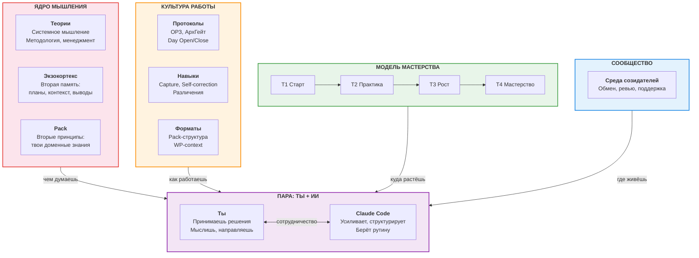
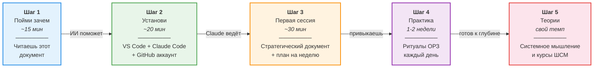
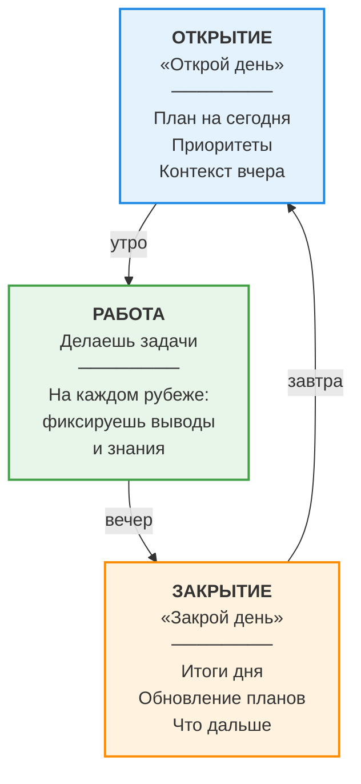
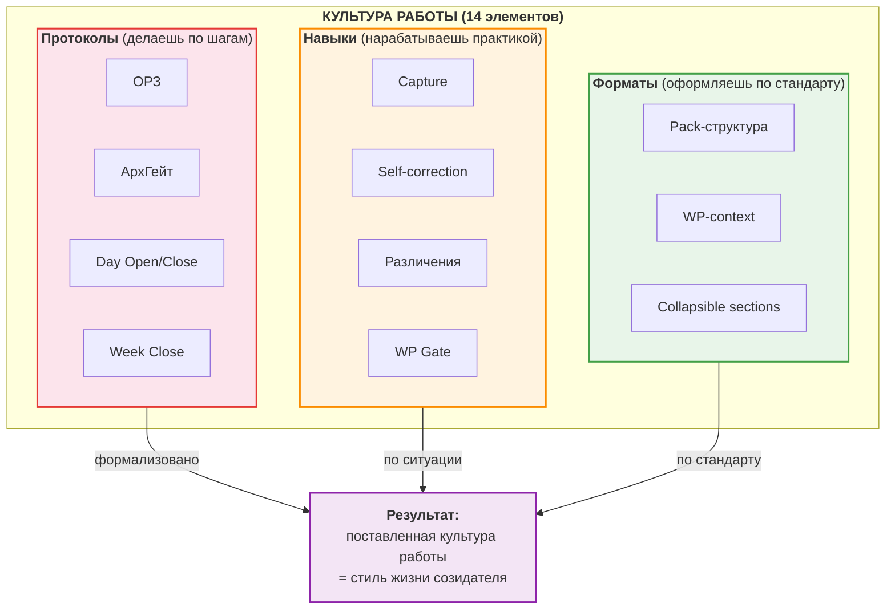
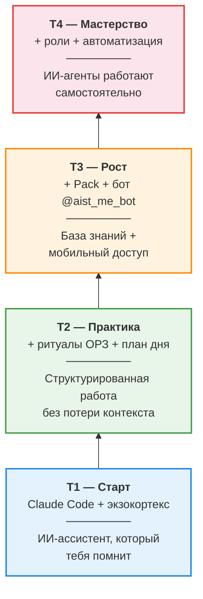
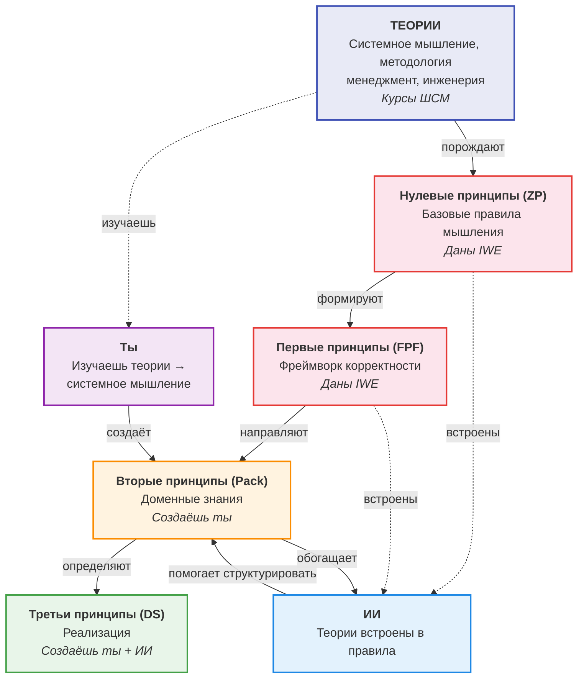
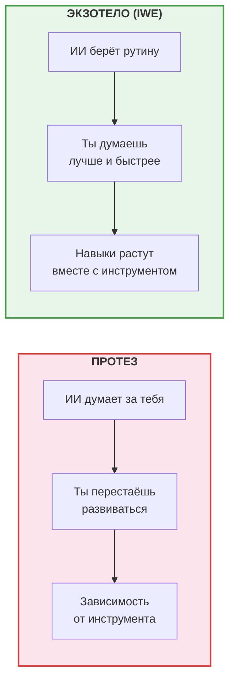
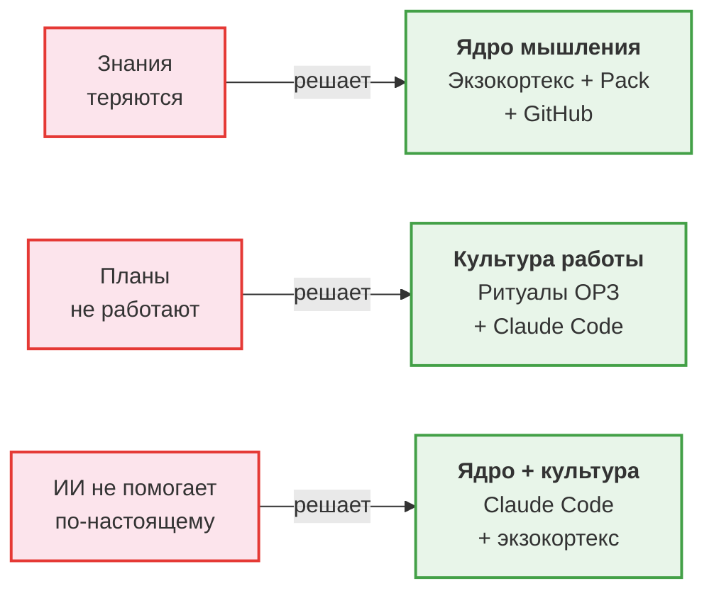

# Визуальные схемы IWE для новичков

> Схемы в формате Mermaid. Рендерятся в GitHub, VS Code (с расширением Mermaid), и большинстве Markdown-редакторов.

---

## Схема 1. Четыре компонента IWE

> IWE = ОС интеллектуальной работы. Четыре компонента, ты в центре, инструменты — средства доставки.

---

## Схема 2. Путь пользователя: от нуля до рабочего IWE

> Пять шагов. Каждый — конкретный результат.

---

## Схема 3. Ритуал ОРЗ (ежедневный цикл)

> Один паттерн для дня и для каждой рабочей сессии.

---

## Схема 3.5. Культура работы — три типа элементов

> 14 элементов культуры работы IWE, разделённых на три типа. Культура — то, за что платят.

---

## Схема 4. Уровни освоения (тиры)

> Начинай с T1. Добавляй компоненты по мере готовности.

---

## Схема 5. Теории → Принципы → Практика

> За IWE стоят теории (ШСМ). Теории порождают принципы. Принципы встроены в ИИ и изучаются тобой.

---

## Схема 6. Экзотело vs Протез

> Ключевое различение IWE: ИИ **расширяет** мышление, а не **заменяет** его. IWE = экзотело для мышления.

---

## Схема 7. Проблема → Решение

> Связь между типичными проблемами и компонентами IWE.

---

*Создан: 2026-03-17 | Обновлён: 2026-03-27 | WP-120 | [FMT-exocortex-template](https://github.com/TserenTserenov/FMT-exocortex-template)*
